# Tempus

Stay informed and organized with the **Tempus**! This application provides the latest news, categorized by topics, and real-time weather updates to keep you prepared for the day. Save your favorite articles and easily search through categories to find the content that matters most.

---

# Features

- 📰 **Latest News**: Access the most recent news articles from a variety of categories.  
- 🔖 **Save Articles**: Bookmark interesting news to revisit anytime.  
- 🔍 **Search by Categories**: Quickly find news based on your interests.  
- 🌦️ **Weather Updates**: Get real-time weather forecasts for your location.  

# Preview
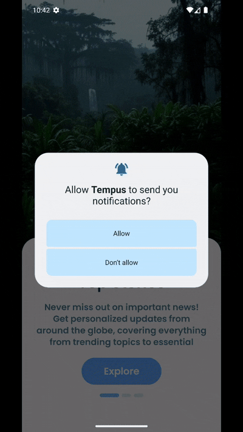 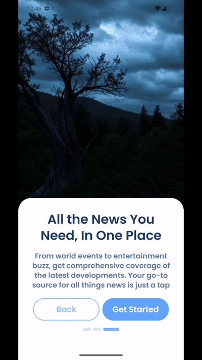 
  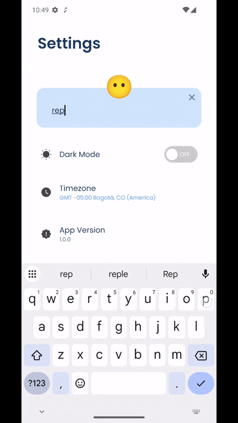 

# Screenshots Light
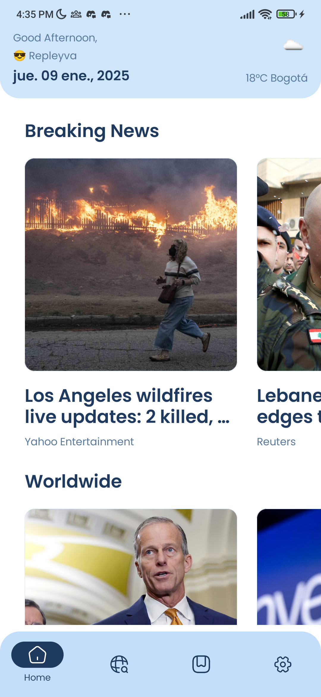 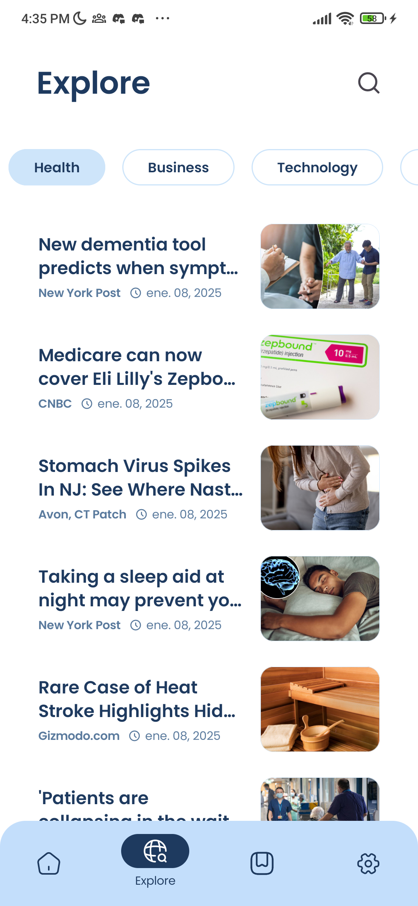 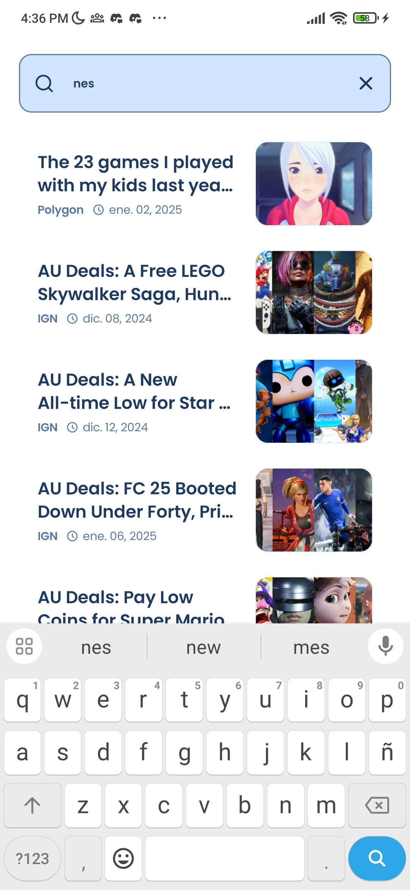 
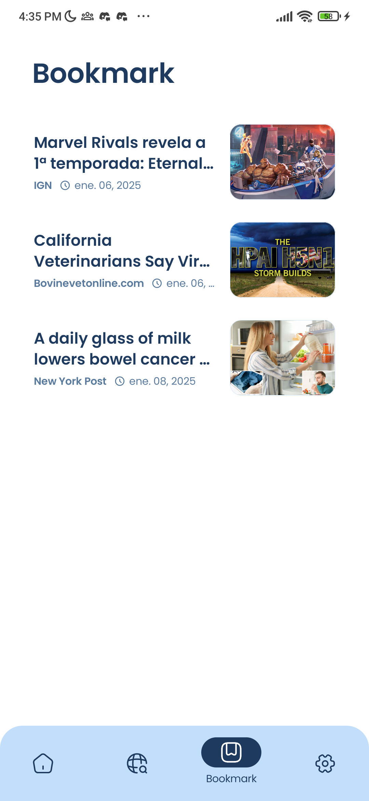  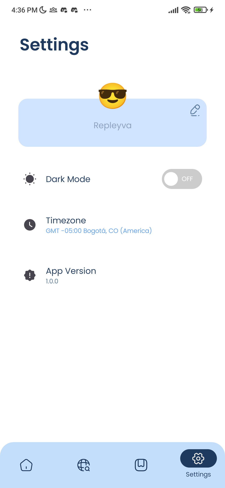 

# Screenshots Dark
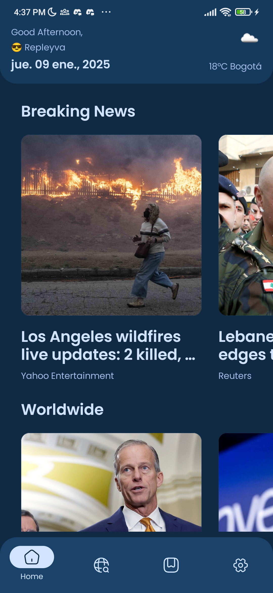 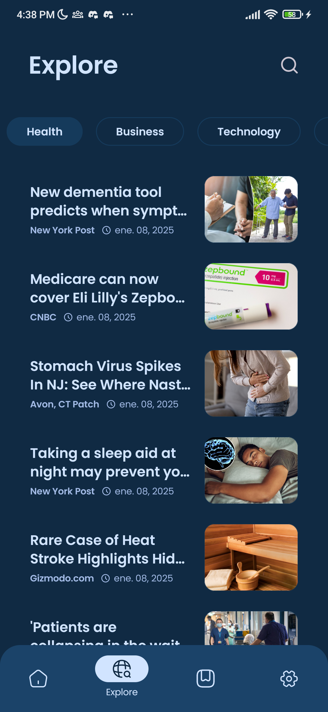 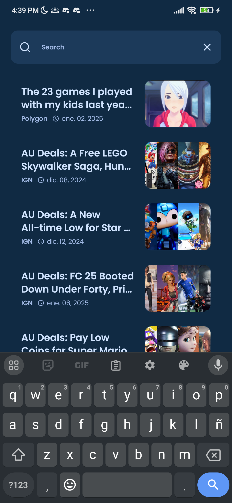 
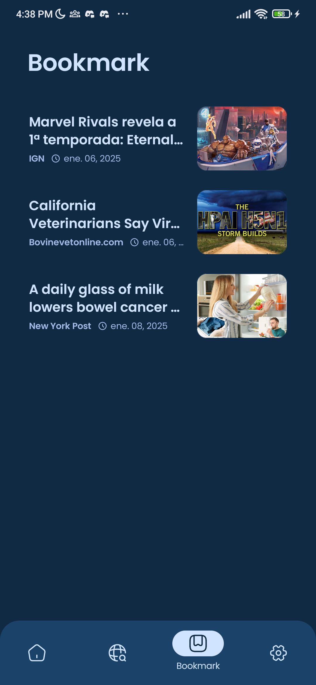  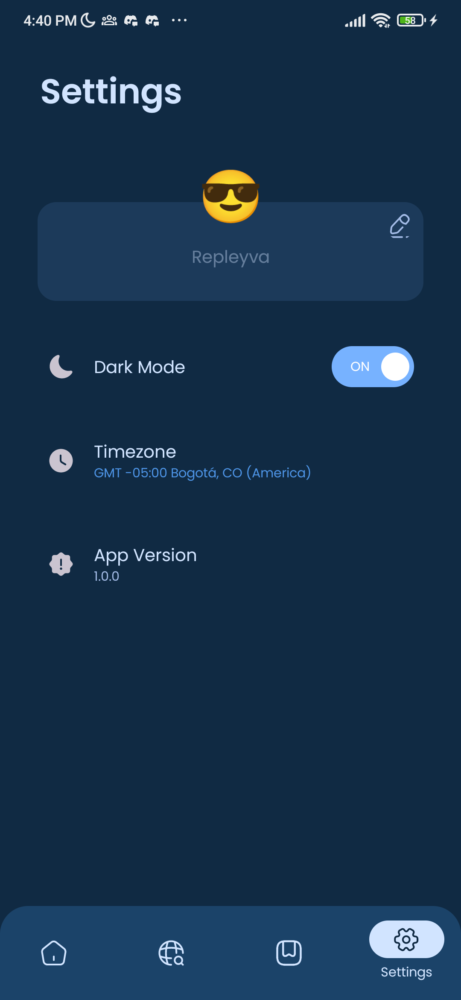 

# Architecture
- Presentation: Responsible for the UI and input management
- Domain: Contains the business logic, including the use cases and repository interfaces
- Data: Responsible for database operations, network requests and caching.


# Technologies Used
|                                                                                                                    |                                                                                            |                                                                                     |
|--------------------------------------------------------------------------------------------------------------------|------------------------------------------------------------------------------------------- |-------------------------------------------------------------------------------------|
|  | [**Kotlin**](https://kotlinlang.org/)                                           | Official language for Android development, known for its concise syntax             |
|                  | [**Jetpack Compose**](https://developer.android.com/jetpack/compose)                       | A modern toolkit for building native Android UIs                                    |                              |
|                                      | [**Paging Library**](https://developer.android.com/topic/libraries/architecture/paging)    | Efficiently loads data in chunks (paging)                                           |
|                                      | [**LiveData**](https://developer.android.com/topic/libraries/architecture/livedata)        | An observable data holder for UI updates                                            |
|                                      | [**ViewModel**](https://developer.android.com/topic/libraries/architecture/viewmodel)      | Retains UI data across configuration changes                                        |
|                                      | [**Navigation Components**](https://developer.android.com/guide/navigation/navigation-getting-started) | Simplifies app navigation                                               |
|                                    | [**Retrofit**](https://square.github.io/retrofit/)                                         | A type-safe HTTP client for making API requests                                     |
|                                      | [**Room**](https://developer.android.com/training/data-storage/room)                       | A persistence library for local database management                                 |
|                                      | [**DataStore**](https://developer.android.com/topic/libraries/architecture/datastore)      | Async key-value and typed data storage with Kotlin coroutines                       |                                                |
|                                                | [**NewsAPI**](https://newsapi.org/)                                                        | A third-party API for fetching news articles                                        |
|                                   | [**OpenWeatherMap**](https://openweathermap.org/)                                          | A third-party API for fetching real-time weather data                               |
|                        | [**Hilt**](https://dagger.dev/hilt/)                                                       | A dependency injection library that simplifies injecting dependencies in Android apps |
|                               | [**OkHttp**](https://square.github.io/okhttp/)                                             | A networking library for HTTP requests                                              |
|                                         | [**JUnit**](https://junit.org/junit5/)                                                     | A testing framework for writing unit tests                                          |
|                                  | [**MockK**](https://mockk.io/)                                                             | A mocking framework for unit testing Kotlin code                                    |
|                                   | [**Turbine**](https://github.com/cashapp/turbine)                                          | A testing library for Kotlin Flows                                                  |

# Requirements

- Android 8.0 (API level 26) or higher  
- Stable internet connection  

# Build setup
App is using the following keys to work:

`google-services.json`
- The app will fail if you don't have this.
- Get this file when you create Firebase project with at least one Android application.
- Add the JSON file in `tempus/app/src`

News API and OpenWeatherMap
- Since both of these keys refer to `buildConfig`, create your own API keys and add them in your `local.properties`:
```
API_KEY = <YOUR_NEWS_API_KEY>
WEATHER_KEY = <YOUR_OPEN_WEATHER_MAP_KEY>
```
